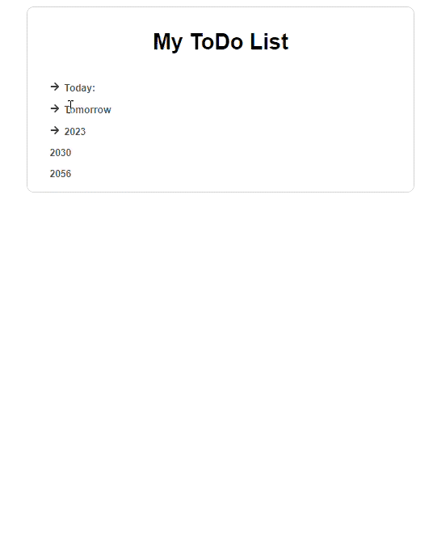
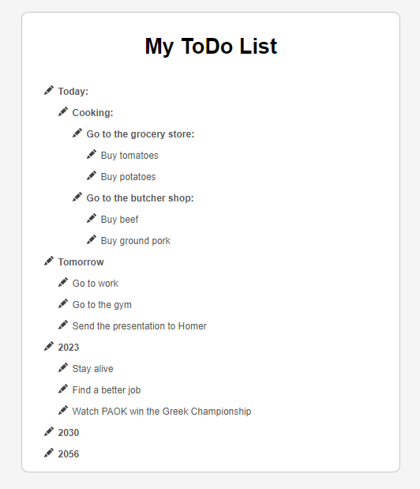

<div id="top"></div>
<!-- React Tree List -->

[![Issues][issues-shield]][issues-url]
[![Apache-2.0 License][license-shield]][license-url]
[![LinkedIn][linkedin-shield]][linkedin-url]

<!-- PROJECT -->
<div align="center">
  <h3 align="center">React Tree List</h3>
  <p align="center">  
    <a href="https://github.com/spyreto/react-tree-list/issues">Report Bug</a>
    ·
    <a href="https://github.com/spyreto/react-tree-list/issues">Request Feature</a>
  </p>
</div>

# React Tree List

<details>
    <summary>Table of Contents</summary>
    
  - [1. Overview](#1-overview)
  - [2. Installation](#2-installation)
  - [3. List format](#3-list-format)
  - [3. `<DropDown/>`](#3-dropdown)
    - [Example usage](#example-usage)
      - [React](#react)
      - [CSS file](#css-file)
    - [Props description](#props-description)
  - [4. `<TreeList/>`](#4-treelist)
    - [Example usage](#example-usage-1)
      - [React](#react-1)
      - [CSS file](#css-file-1)
    - [Props description](#props-description-1)
  - [5. Contributing](#5-contributing)
  - [6. License](#6-license)
  - [7. Contact](#7-contact)
  
 </details> 

 &nbsp;

## 1. Overview

Display hierarchical data in React in two ways dropdown list or tree grid view list. Has been developed in such a way as to give to the user freedom in styling the components

<p align="right">(<a href="#top">back to top</a>)</p>


<!-- GETTING STARTED -->
## 2. Installation

```bash
yarn add @spyreto/react-tree-list
# or
npm install @spyreto/react-tree-list
```


## 3. List format

```js
const toDoList = [
  {
    content: "Today:",
    children: [
      {
        content: "Cooking:",
        children: [
          {
            content: "Go to the grocery store:",
            children: [
              {
                content: "Buy tomatoes"
              },
              {
                content: "Buy potatoes"
              }
            ],
          }
        ],
      }
    ]
  },
  {
    content: "Tomorrow",
    children: [
      {
        content: "Go to work",
      },
      {
        content: "Go to the gym",
      },
      {
        content: "Send the presentation to Homer",
      },
    ],
  },
  .
  .
  .
];

```


<p align="right">(<a href="#top">back to top</a>)</p>

## 4. `<DropDown/>`
&nbsp;



### Example usage

#### React 
```jsx
import React from "react";

import { DropDownList } from "@spyreto/react-tree-list";
import "./App.css";

import data from "./data";

function App() {
  return (
    <div className="app">
      <div className="drop-down-list-container">
        <h1 className="header">My ToDo List</h1>
        <DropDownList
          className="drop-down-list"
          innerListClass="inner-list"
          innerListHeaderClass="inner-list-header"
          firstItemClass="first-item"
          listItemClass="list-item"
          list={data}
          iconOpenClass="open-icon"
          iconCloseClass="close-icon"
        />
      </div>
    </div>
  );
}
```
&nbsp;

#### CSS file
```css 
.drop-down-list-container {
  display: flex;
  flex-direction: column;
  justify-content: flex-start;
  align-items: flex-start;
  gap: 2.4rem;
  border: 0.2rem solid #c7c7c7;
  border-radius: 1.2rem;
}

.header {
  align-self: center;
  margin-top: 3.6rem;
  font-size: 3.6rem;
  color: black;
  font-weight: 600;
}

.drop-down-list {
  margin: 1.2rem 3.6rem;
  list-style-type: none;
  font-size: 1.6rem;
}

.inner-list {
  list-style-type: none;
  margin-left: 2.4rem;
}
.first-item,
.inner-list-header {
  padding: 0.8rem 0;
  font-weight: 600;
}

.first-item,
.list-item {
  padding: 0.8rem 0;
}

.list-icon {
  padding-right: 0.8rem;
  width: 2.4rem;
  color: #424242;
}

.close-icon,
.open-icon {
  padding-right: 0.8rem;
  width: 2.4rem;
  color: #424242;
}

```
&nbsp;

### Props description

| Property             | Type        | Description                                                    | Default                     |
| -------------------- | ----------- | -------------------------------------------------------------- | --------------------------- |
| list                 | array       | List data                                                      | []                          |
| className            | string      | Component class                                                | ""                          |
| innerListHeaderClass | string      | Nested list headings class (```<li>``` )                       | ""                          |
| innerListClass       | string      | Nested list  class (```<ul>``` )                               | ""                          |
| firstItemClass       | string      | Main list items that do not have a nested list   (```<li>``` ) | ""                          |
| listItemClass        | string      | List items class (```<li>``` )                                 | ""                          |
| iconOpenClass        | string      | Class of the open list icon                                    | ""                          |
| iconCloseClass       | string      | Class of the close list icon                                   | ""                          |
| content              | elementType | Element in which to display the contents of the list           | ```<li> "content" <li/> ``` |
| openIcon             | elementType | Open nested list icon                                          | ```<FaArrowRight/> ```      |
| closeIcon            | elementType | Close nested list icon                                         | ```<FaArrowDown/>```        |

<p align="right">(<a href="#top">back to top</a>)</p>


## 5. `<TreeList/>`

&nbsp;



&nbsp;

### Example usage

&nbsp;

#### React 
```jsx
import React from "react";
import { DropDownList } from "@spyreto/react-tree-list";

import { BsFillPencilFill } from "react-icons/bs";
import "./App.css";

import data from "./data";

function App() {
  const listIcon = (props) => {
    return (
      <React.Fragment>
        <BsFillPencilFill />
        <span>{props.content}</span>
      </React.Fragment>
    );
  };

  return (
    <div className="app">
      <div className="tree-list-container">
        <h1 className="header">My ToDo List</h1>
        <TreeList
          className="tree-list"
          innerListClass="inner-list"
          innerListHeaderClass="inner-list-header"
          firstItemClass="first-item"
          listItemClass="list-item"
          list={data}
          content={listIcon}
        />
      </div>
    </div>
  );
}
```
&nbsp;

#### CSS file
```css 
.tree-list-container {
  display: flex;
  flex-direction: column;
  justify-content: flex-start;
  align-items: flex-start;
  gap: 2.4rem;
  border: 0.2rem solid #c7c7c7;
  border-radius: 1.2rem;
}

.header {
  align-self: center;
  margin-top: 3.6rem;
  font-size: 3.6rem;
  color: black;
  font-weight: 600;
}

.tree-list {
  margin: 1.2rem 3.6rem;
  list-style-type: none;
  font-size: 1.6rem;
}

.inner-list {
  list-style-type: none;
  margin-left: 2.4rem;
}
.first-item,
.inner-list-header {
  padding: 0.8rem 0;
  font-weight: 600;
}

.first-item,
.list-item {
  padding: 0.8rem 0;
}

.list-icon {
  padding-right: 0.8rem;
  width: 2.4rem;
  color: #424242;
}

```
&nbsp;

### Props description

| Property             | Type        | Description                                                    | Default                     |
| -------------------- | ----------- | -------------------------------------------------------------- | --------------------------- |
| list                 | array       | List data                                                      | []                          |
| className            | string      | Component class                                                | ""                          |
| innerListHeaderClass | string      | Nested list headings class (```<li>``` )                       | ""                          |
| innerListClass       | string      | Nested list  class (```<ul>``` )                               | ""                          |
| firstItemClass       | string      | Main list items that do not have a nested list   (```<li>``` ) | ""                          |
| listItemClass        | string      | List items class (```<li>``` )                                 | ""                          |
| content              | elementType | Element in which to display the contents of the list           | ```<li> "content" <li/> ``` |

<p align="right">(<a href="#top">back to top</a>)</p>

<!-- CONTRIBUTING -->
## 6. Contributing

Contributions are what make the open source community such an amazing place to learn, inspire, and create. Any contributions you make are **greatly appreciated**.

If you have a suggestion that would make this better, please fork the repo and create a pull request.
Don't forget to give the project a star! Thanks again!

1. Fork the Project
2. Create your Feature Branch (`git checkout -b feature/AmazingFeature`)
3. Commit your Changes (`git commit -m 'Add some AmazingFeature'`)
4. Push to the Branch (`git push origin feature/AmazingFeature`)
5. Open a Pull Request

<p align="right">(<a href="#top">back to top</a>)</p>

<!-- LICENSE -->

## 7. License

Distributed under the MIT License. See `LICENSE.txt` for more information.

<p align="right">(<a href="#top">back to top</a>)</p>

<!-- CONTACT -->

## 8. Contact

Dimos - Spiridon Dimou - [Linkedin](https://www.linkedin.com/in/spiridon-dimou-2aa98216b) - spirosdimou22@gmail.com

Project Link: [React Tree List](https://github.com/spyreto/react-tree-list)

<p align="right">(<a href="#top">back to top</a>)</p>

<!-- MARKDOWN LINKS & IMAGES -->
<!-- https://www.markdownguide.org/basic-syntax/#reference-style-links -->

[issues-shield]: https://img.shields.io/github/issues/spyreto/react-tree-list?style=flat-square
[issues-url]: https://github.com/spyreto/react-tree-list/issues
[license-shield]: https://img.shields.io/github/license/spyreto/react-tree-list?style=flat-square
[license-url]: https://github.com/spyreto/react-tree-list/blob/main/LICENSE
[linkedin-shield]: https://img.shields.io/badge/-LinkedIn-black.svg?style=flat-square&logo=linkedin&colorB=555
[linkedin-url]: https://www.linkedin.com/in/spiridon-dimou-2aa98216b/
